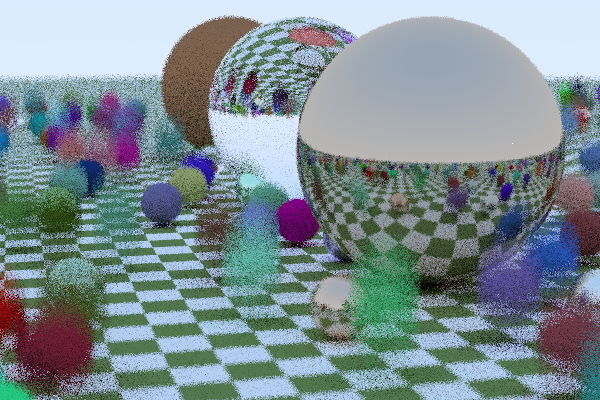

<!-- TOC -->

- [PyGame Ray Tracing](#pygame-ray-tracing)
  - [Ray Tracing in One Weekend](#ray-tracing-in-one-weekend)
    - [Materials: Diffuse, Metal, Dielectrics](#materials-diffuse-metal-dielectrics)
    - [Defocus Blur](#defocus-blur)
    - [Cover scene](#cover-scene)
  - [Ray Tracing: the Next Week](#ray-tracing-the-next-week)
    - [Motion Blur](#motion-blur)
    - [Noise Texture](#noise-texture)

<!-- /TOC -->

# PyGame Ray Tracing

Based on [Peter Shirley's](https://research.nvidia.com/person/peter-shirley) books: 
- ["Ray Tracing in One Weekend (Ray Tracing Minibooks Book 1)"](https://www.goodreads.com/book/show/28794030-ray-tracing-in-one-weekend)
- ["Ray Tracing: the Next Week (Ray Tracing Minibooks Book 2)"](https://www.amazon.com/Ray-Tracing-Weekend-Minibooks-Book-ebook/dp/B01B5AODD8)

Implemented in [Python 3.7](https://www.python.org/) with [PyGame](https://www.pygame.org/wiki/about) library.

## Ray Tracing in One Weekend

### Materials: Diffuse, Metal, Dielectrics

### Defocus Blur

### Cover scene

## Ray Tracing: the Next Week

### Motion Blur

### Noise Texture

---

Recommended

- [Ray Tracing in C#](https://github.com/Rabbid76/c_sharp_raytrace_examples)
- [PeterShirley/raytracing.github.io](https://github.com/RayTracing/raytracing.github.io)
- [PeterShirley/RayTraycingInOneWeekend](https://github.com/RayTracing/InOneWeekend)
- [PeterShirley/RayTraycingTheNextWeek](https://github.com/RayTracing/TheNextWeek)
- [PeterShirley/RayTraycingTheRestOfYourLife](https://github.com/RayTracing/TheRestOfYourLife)
